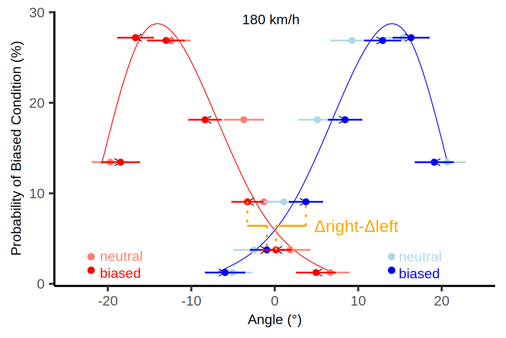
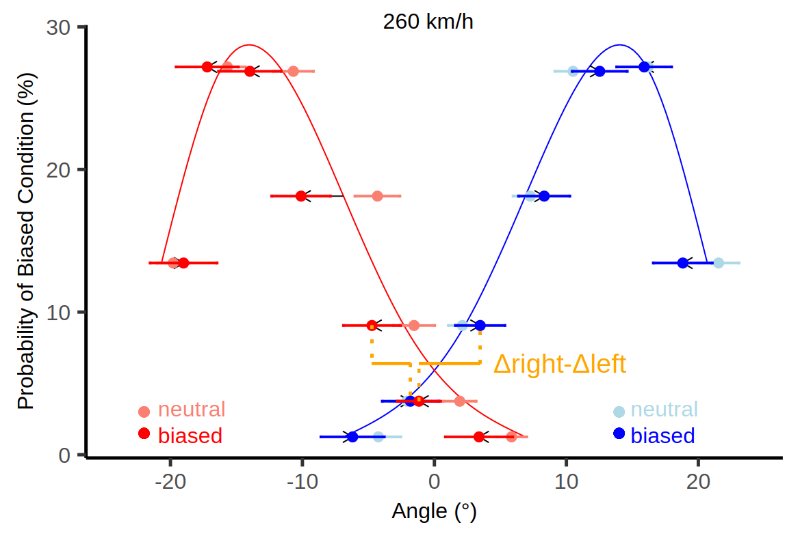

# Bayesian Integration in Tennis

This is the repository for our work “*From simple lab tasks to the virtual court: Bayesian integration in tennis*” containing data and code used for the data analysis and visualisation.

We developed an immersive VR tennis environment. In two experiments, we tested how participants integrate prior and sensory information when returning tennis serves. As an indicator of their estimation of the ball-bounce location, we analysed predictive gaze behaviour.

## Descriptive Analysis 

The folders [descriptive_all_trials_exp_1](./descriptive_all_trials_exp_1) and [descriptive_all_trials_exp_2](./descriptive_all_trials_exp_2) contain the dataset, R script and R studio project to reproduce the calculations of all descriptive statistics and plots (Figure 3 left) for Experiments 1 and 2 respectively. Additionally, interactive 3D HTML plots for each bounce position can be found in the folders [interactive_3D_plots Exp1](./descriptive_all_trials_exp_1/plots/interactive_3D_plots) and [interactive_3D_plots Exp2](./descriptive_all_trials_exp_2/plots/interactive_3D_plots). These plots provide a 3D visualization of aggregated gaze behavior in the plane in which the fixations were calculated (based on an aggregated head position for illustration) over the course of a trial.
|                                                            Experiment 1                                                             |                                                            Experiment 2                                                             |
| :---------------------------------------------------------------------------------------------------------------------------------: | :---------------------------------------------------------------------------------------------------------------------------------: |
|  |  |

| index   	| block  	| y  	|
|---	|---	|---	|
| participant ID   	| block ID  	| difference between participants’ ball bounce estimations (gaze location or explicit judgement) and the actual bounce location when experiencing the right vs. the left distribution (&Delta;right - &Delta;left) (our main dependent variable) |

## Multilevel Analysis 

The folder [multilevel_analysis](./multilevel_analysis) contains the dataset, R script and R studio project to reproduce the calculations of all inferential statistics and plots (Figure 3 right) for Experiment 1 and 2 respectively.

|                                                            Experiment 1                                                             |                                                            Experiment 2                                                             |
| :---------------------------------------------------------------------------------------------------------------------------------: | :---------------------------------------------------------------------------------------------------------------------------------: |
|  |  |
